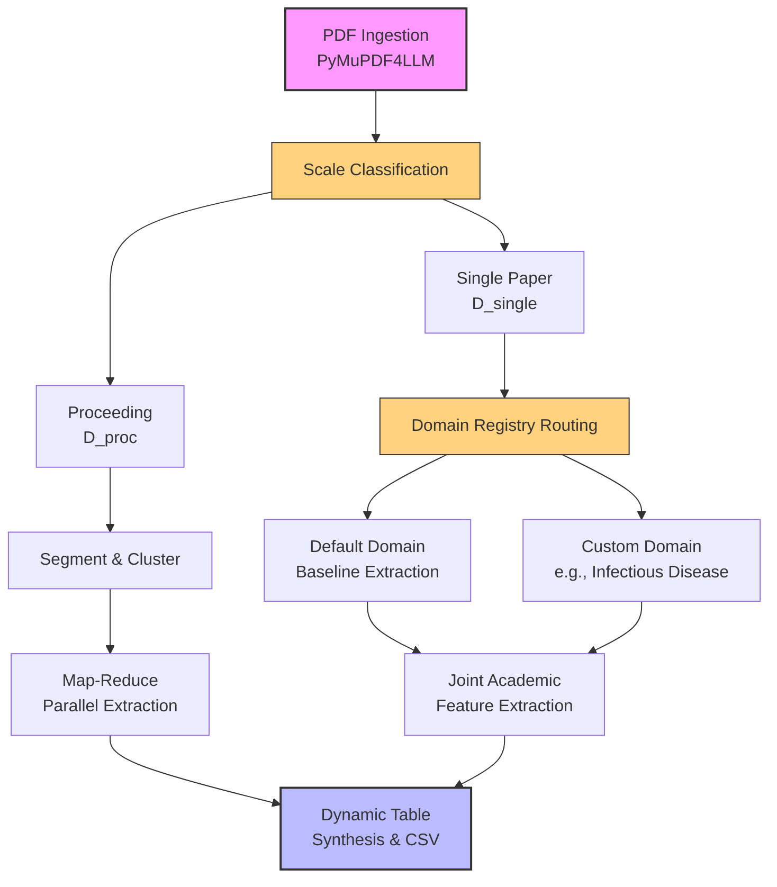

# Scientific Content Extractor

A modular, domain-driven agentic framework designed to parse and extract structured comparative data from scientific literature. 

The system leverages **LangGraph** for granular multi-agent orchestration, **FastAPI** for REST endpoints, **Celery/Redis** for resilient asynchronous task queuing, and **Streamlit** for interactive visualization. It natively conforms to the open **agentskills.io** specification for dynamic, file-based skill injection.

---

## 1. Architectural Blueprint & Core Philosophy

The system's core objective is to extract comparative matrices from scientific texts. Instead of relying on a monolithic extraction prompt (which frequently suffers from context leakage, baseline misattribution, and metrics halluncinations), this project splits tasks across highly specialized, atomic agents.



### Key Design Principles

1. **One Task per Agent**: Each node in the execution graph has a single, isolated cognitive responsibility (e.g., identifying baseline names, extracting tabular row data, or grouping papers).
2. **Dynamic Domain Customization (The Template Pattern)**: The system is easily extensible. You can define a target scientific domain (e.g., `infectious-disease`) by registering a specific Pydantic schema and writing a markdown instruction set (`SKILL.md`). The orchestrator dynamically routes and loads these files at runtime.
3. **Strict Non-Inheritance**: To avoid context leakage, baseline rows do not inherit metadata (authors, DOIs, URLs, or venues) from the primary proposed paper unless explicitly cited.
4. **Model-Agnostic LLM Interface**: Through LangChain integrations, the backend is decoupled from any specific model provider. It supports OpenAI, Anthropic, or local LLMs (via Ollama) interchangeably.

---

## 2. Directory Structure

This project follows Clean Code and Domain-Driven Design (DDD) principles:

```text
scientific-extractor/
├── app/
│   ├── api/
│   │   └── endpoints.py         # FastAPI routes (/ingest, /tasks)
│   ├── core/
│   │   ├── celery_app.py        # Celery client initialization
│   │   ├── config.py            # Environment validation
│   │   ├── domains_registry.py  # Domain-specific config mappings
│   │   ├── llm_factory.py       # Model-agnostic LLM initializer
│   │   ├── parse_pdf.py         # Programmatic PDF extraction helper
│   │   ├── schemas.py           # Core Pydantic output schemas
│   │   └── skills_loader.py     # agentskills.io metadata parser
│   ├── domains/
│   │   └── infectious_disease/
│   │       └── schemas.py       # Infectious Disease custom Pydantic schemas
│   ├── services/
│   │   └── orchestrator.py      # LangGraph state machine & node agents
│   └── main.py                  # API entrypoint
├── skills/                      # agentskills.io dynamic skills
│   ├── academicextraction/
│   │   └── SKILL.md             # Standard comparison extraction guidelines
│   ├── infectious-disease-extraction/
│   │   └── SKILL.md             # Pathogen & clinical trials guidelines
│   └── structuralclustering/
│       └── SKILL.md             # Document segmenter instructions
├── app_ui.py                    # Streamlit visualizer
├── requirements.txt             # Project dependencies
└── .env.example                 # Environment variables blueprint
```

---

## 3. Dynamic Domain Extensibility

To add a new scientific domain (e.g., `oncology` or `materials-science`):

### Step A: Define the Schema
Create a new schemas folder: `app/domains/your_domain/schemas.py`. Define a row template (`YourDomainRow`) and a table wrapper (`YourDomainComparisonTable`).
```python
from pydantic import BaseModel, Field
from typing import List, Optional

class YourDomainRow(BaseModel):
    paper_title: str
    authors: List[str]
    custom_metric: Optional[str] = Field(None, description="Your description")

class YourDomainComparisonTable(BaseModel):
    research_problem: str
    rows: List[YourDomainRow]
```

### Step B: Create the agentskills.io Specification
Create a new skill folder: `skills/your-domain-extraction/SKILL.md`. Include a YAML frontmatter block and step-by-step instructions.
```markdown
---
name: yourdomainextraction
description: Explain when to trigger this domain skill.
metadata:
  - version: 1.0.0
---
# Skill: Your Domain Extraction Guidelines
Provide detailed clinical/scientific heuristics for parsing.
```

### Step C: Register the Domain
Register the new domain in `app/core/domains_registry.py`:
```python
from app.domains.your_domain.schemas import YourDomainComparisonTable

DOMAINS_REGISTRY["your-domain"] = DomainConfig(
    schema_class=YourDomainComparisonTable,
    skill_path=Path("skills/your-domain-extraction")
)
```

The orchestrator and Streamlit UI will automatically pick up this configuration without any further modifications.

---

## 4. Setup & Local Installation

### Prerequisites
*   Python 3.11 or 3.12
*   Docker (recommended for running Redis)
*   An API key for your chosen LLM provider (or a running Ollama instance)

### 1. Environment Activation
```bash
# Clone the repository and navigate to its root directory
git clone https://github.com/NchourupouoM/automatic-generation-of-comparison_tables.git
cd scientific-paper-content-extractor

# Create and activate a virtual environment
python -m venv .venv
source .venv/bin/activate  # On Windows: .\.venv\Scripts\activate
```

### 2. Install Dependencies
```bash
pip install --upgrade pip
pip install -r requirements.txt
pip install uvicorn streamlit pandas PyYAML
```

### 3. Configure Variables
Copy the example configuration to a local `.env` file:
```bash
cp .env.example .env
```
Open `.env` and fill in your keys:
```env
REDIS_URL=redis://localhost:6379/0
LLM_PROVIDER=openai
LLM_MODEL_NAME=gpt-4o
# LLM_PROVIDER=ollama
# LLM_MODEL_NAME=llama
OPENAI_API_KEY=your-openai-api-key
```

### 4. Start Services (Requires 3 Terminals)

#### Terminal 1: Run Redis
```bash
docker run --name redis-extractor -p 6379:6379 -d redis
```

#### Terminal 2: Run Celery Worker
```bash
celery -A app.core.celery_app:celery_app worker --loglevel=info
# On Windows, add '-P solo' if you experience execution loops:
# celery -A app.core.celery_app:celery_app worker --loglevel=info -P solo
```

#### Terminal 3: Run FastAPI App
```bash
uvicorn app.main:app --reload --port 8000
```

---

## 5. Running and Testing the Pipeline

### Testing with Streamlit (Interactive UI)
Open a 4th terminal, activate the virtual environment, and run:
```bash
streamlit run app_ui.py
```
Open the visualizer at `http://localhost:8501`. 
*   Drop a PDF of a paper or a proceeding.
*   Select your **Scientific Domain Template** (e.g., "Infectious Disease" or "General Academic").
*   Click **Start Extraction Task**. Streamlit will poll the task in the background and display the final comparative matrix as a clear flat table, ready for a **CSV Download**.

### Testing with cURL (API Mode)

1. **Ingest a Paper** (Example for Infectious Disease):
   ```bash
   curl -X POST "http://localhost:8000/api/v1/ingest" \
     -F "file=@/path/to/your/infectious_disease_paper.pdf" \
     -F "document_type=single" \
     -F "domain=infectious-disease"
   ```
   **Response**:
   ```json
   {
     "task_id": "84a37bde-3456-4cde-a12e-1234567890ab",
     "status": "PENDING",
     "detail": "Processing in domain 'infectious-disease' started."
   }
   ```

2. **Poll for the Status & Consolidated Results**:
   ```bash
   curl -X GET "http://localhost:8000/api/v1/tasks/84a37bde-3456-4cde-a12e-1234567890ab"
   ```

---

## 6. Contribution Standards & Code Quality

To keep the project maintainable and robust, contributors must adhere to the following rules:
*   **Strong Typing**: All payloads must be strictly validated using Pydantic. Avoid arbitrary `dict` returns.
*   **Strict Non-Inheritance**: Ensure that any new extraction skill strictly instructs the agent not to copy coordinates of the main paper onto baselines.
*   **Agnostic LLM Binding**: Do not instantiate LLM clients directly inside the skills or services. Always request them from `LLMFactory.get_llm()` to ensure interoperability across model providers.

---

## 7. Testing & Evaluation

The project's value depends on the *accuracy* of the tables it extracts, so
quality is measured, not assumed.

### Unit tests (no API key required)
```bash
pip install -r requirements-dev.txt
pytest -m "not llm"
```
These cover the pure scorer (`tests/eval/scoring.py`) and pipeline smoke checks,
and run automatically in CI (`.github/workflows/tests.yml`) on every push and PR.

### Extraction accuracy benchmark
`tests/fixtures/` holds **gold** examples — real papers paired with their
hand-verified correct comparison tables. The evaluation runner drives the actual
extraction pipeline over them and reports row/cell precision, recall and F1, plus
metadata-leakage checks:
```bash
python -m tests.eval.runner            # real run — needs a configured LLM in .env
python -m tests.eval.runner --fake     # wiring smoke test, no API key
python -m tests.eval.runner --min-f1 0.70   # fail if aggregate cell-F1 drops below 0.70
```
The fixtures shipped with `.example.json` names are **placeholders** — replace
them with real ground-truth (see `tests/fixtures/README.md`). Once real gold and
an API-key secret are in place, uncomment the accuracy gate in the CI workflow to
block pull requests that regress extraction quality.